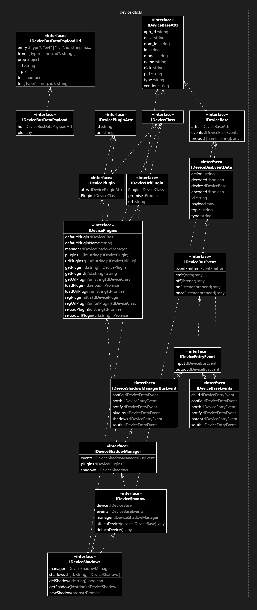

# 软件设计说明 #
该文档描述"边缘组件"的主要设计，包括内部组件结构、主要流程等。

# 整体功能 #
## 概述 ##
### 目的 ### 
    市场上的设备种类各种各样、琳琅满目，要将设备升级为智能设备，必须是：设备+互联网，也就是让设备走互联网通讯来采集数据或控制设备。其数据通讯模型可归纳为：设备数据+远程通讯+数据编解码+远程通讯+云端物模型。本组件主要为“数据编解码”提供一个数据流管理器，统一输入与输出接口，更重要的是提供“数据编解码”动态插件式管理，为区域范围内的设备提供状态缓存及相应的编解码器（即影子设备），解决设备数据协议和结构差异化的问题，故称之为边缘组件。

### 核心功能 ###
    1. 影子设备（编解码器）插件化
    2. 影子设备插件的本地和远程加载
    3. 影子设备实例的动态创建和删除
    4. 影子设备消息的自动分配与路由
    5. 提供插件式编解码器基类，以便开发者开发插件

### 设计概要 ###
    Nodejs开发、npm独立组件、Node-Red组件封装、提供插件基类供设备插件开发

## 功能拆解 ##

|模块|一级功能|备注说明|
|----|----|----|
|消息分发器|插件消息分发|将插件类消息路由至插件类输入输出接口|
|   |影子消息分发|将影子类消息路由至影子类输入输出接口|
|   |配置消息分发|将配置类消息路由至配置类输入输出接口|
|	|南向（设备）消息分发|	将设备类消息路由至设备类输入输出接口|
|	|北向（平台）消息分发|	将平台类消息路由至平台类输入输出接口|
|插件管理器|	注册插件|	注册插件标识ID和插件URL|
|	|加载插件|	动态、异步、远程载入设备插件类|
|	|重载插件|	更新、重新载入插件类|
|	|获取插件|	引用插件类，以便实例化|
|设备管理器|	创建设备|	根据相应插件实例化设备|
|	|删除设备|	根据设备ID删除设备实例|
|影子管理器|	创建影子|	创建设备的一个外层包装，接收输入，触发输出|
|	|删除影子|	删除设备的包装|
|	|关联设备|	将影子实例与设备实例一一对应|
|插件开发|	插件基类|	继承此插件接口，拦截数据和编码及解码数据|

核心类图

组件图

时序图

