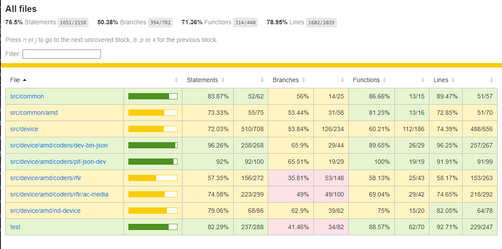
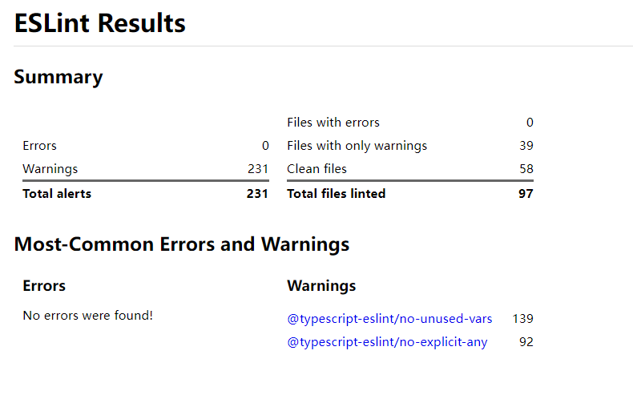
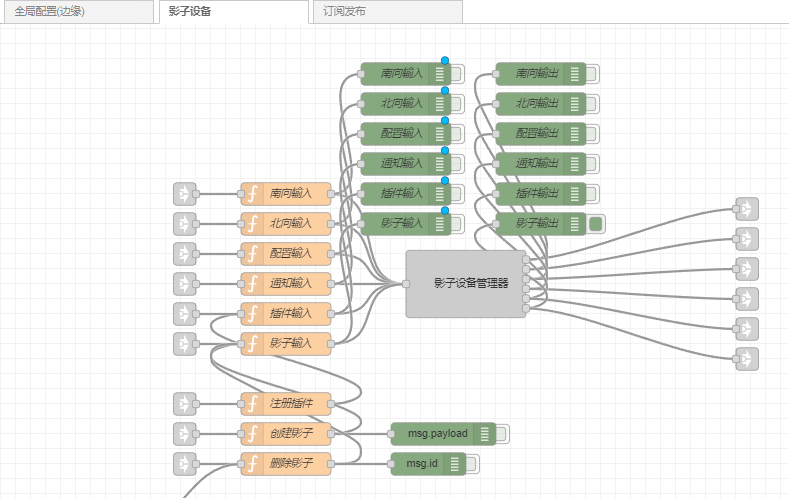

# 代码质量 #
## 覆盖率（istanbul + mocha） ##

## 静态代码检测(eslint) ##

# 关联组件 #
无

# 设计文档 #
[概要设计](docs/outline_design.md)

# 使用说明 #
[使用说明](docs/howtouse.md)

[API文档](http://betacs.101.com/v0.1/static/preproduction_content_nd_iot_edg/ndiot-device-shadow/docs/typedoc/index.html)

# 组件测试 #
[单元测试报告](docs/coverage/mocha-coverage.txt)

# 版本发布 #
[生产环境](https://nd-iot-edge.sdp.ndaeweb.com/edg/)

